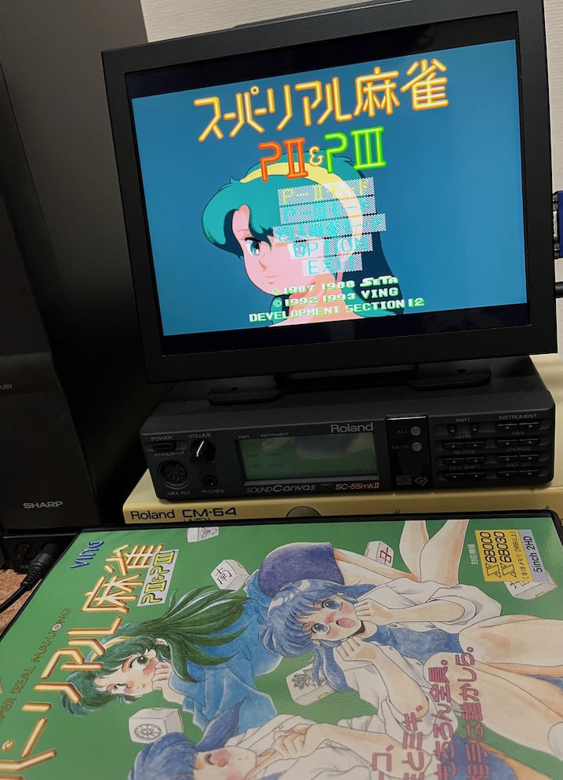
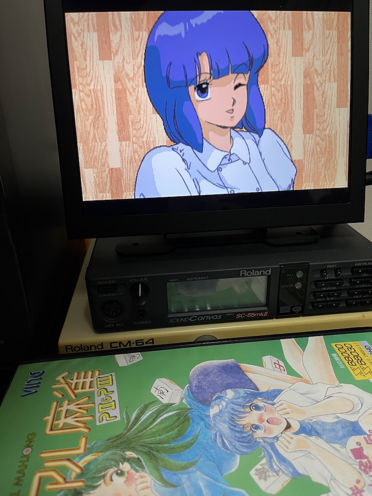

# srm-p2p3-x68k
X680x0版 スーパーリアル麻雀P2P3 に関する覚書

---

## はじめに

この覚書はX68000/X68030用ゲームソフトの一つである、スーパーリアル麻雀P2P3 (SETA/VING) に関するメモです。

以下について記述しています。

* ハードディスクインストール
* KVCLab.9.7"モニタでの不具合とその対策パッチ
* 攻略法
* X68000XVI+PhantomXでの動作
* X68030+060turboでの動作

---

## ハードディスクインストール

本ソフトは標準でハードディスクインストールに対応しています。システムディスク(DISK1)の中にあるREADME.DOCに手順が記載されています。

---

## KVCLab.9.7"モニタでの不具合とその対策パッチ

X680x0を始めとするレトロPCやアーケードゲーム基板の31kHzや15kHzを映すことが可能で、発色も非常に綺麗と、人気のあるKVCLab.9.7"モニタ、自分も愛用しています。

* [【新品】 15/24/31KHz対応 中国製 9.7インチ 4:3液晶](https://kvclab.com/shopdetail/000000000489/)

ちなみにAliで買った方が安いですが、KVCLab.の方が全数出荷前に31kHz/15kHzチェックされているので安心です。

* [9.7インチ2kポータブルモニター2048x1536](https://ja.aliexpress.com/item/1005002782657222.html?gatewayAdapt=glo2jpn)

しかし、このモニタを使った場合、本ソフトのP2モード及びP3モードで使われている 384x256 31kHz の画面を正常に映すことができません。手持ちの2台(購入時期は大分異なる)のKVCLab.9.7"モニタを試してみましたがどちらも「信号なし」となってしまいます。本体がXVIであっても030であっても同様です。他のモニタ、例えばDELL P2314Hであれば問題ありません。

この理由は、CRTCに設定しているパラメータがやや攻めた設定になっており、KVCLab.9.7"モニタの追従できる範囲を微妙に超えてしまうためのようです。

そこで、CRTCに設定するパラメータ値を「より一般的な 384x256 31kHz」に修正するパッチを作成してみました。

* [SRMP2.bfd](https://github.com/tantanGH/srm-p2p3-x68k/raw/main/bfd/SRMP2.bfd)

* [SRMP3.bfd](https://github.com/tantanGH/srm-p2p3-x68k/raw/main/bfd/SRMP3.bfd)

### パッチの当て方

パッチを当てるには、`LZX.X` および `BUP.X` が必要です。またハードディスクインストールが必須です。ハードディスク上のファイルに対してパッチを当ててください。

1. オリジナルの `SRMP2.X` と `SRMP3.X` をリネームする。

        ren SRMP2.X SRMP2_ORIG.X
        ren SRMP3.X SRMP3_ORIG.X

2. LZX圧縮されているので展開する。

        lzx -d -o SRMP2.X SRMP2_ORIG.X
        lzx -d -o SRMP3.X SRMP3_ORIG.X

3. パッチを当てる。

        bup SRMP2.bfd
        bup SRMP3.bfd

以上。再LZX圧縮の必要はありません。

なお、厳密にすべての機能を確認したわけではありません。また完全無保証です。モニタ他に何らかの不具合が出ても責任とれませんので悪しからず。

---

## 攻略法

* 無理に高い手を狙う必要はなく、できるだけ早上がりを目指す。ただし食いタンは無い。
* ノーテン罰符が無いので形式テンパイを狙いに行く必要は無い。最後まで上がりを目指す。
* 相手は染め手に行くことがとても多いので、序盤の捨て牌から何に染めてるかの当たりをつけ、なるべくその色で待たないようにする。これは染めている色の牌を切ってくることがほとんど無いため。

---

## X68000XVI+PhantomXでの動作

元々X68030対応ソフトということもあってか、1.03c 68040 モードで特に問題無いように見えます。

---

## X68030+060turboでの動作

060turbo.sysを組み込んだ状態でHDDから起動し、68060 モードで特に問題無いように見えます。

---

## 更新履歴

2023.09.18 ... 多少追記
2023.09.16 ... 初版
